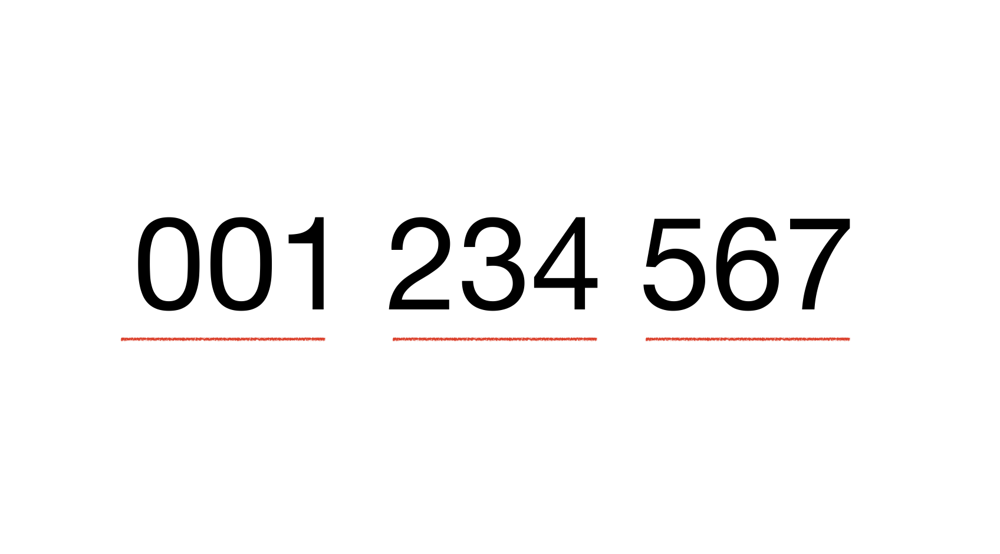

# Problem 91: "num2word"

The task is to create a funtion finds a digit in a string and convert it to its word representation.

## Method



The presented solution to this problem was to iteratively combine the word representation of numbers by its thousand seperators (pockets). The high level overview of the method is

1. Identifiy the thousand seperators - hundreds, thousands, millions and trillions.
2. Start with highest unit and for each pocket
    - Simplify each string int to an int.
    - Use a lookup table to retrieve the number representation.
3. Combine all the pockets word representation.

Quadrillion and higher can follow the same pattern.

## Project Setup

The usage of the funtion is in a python script that can be run as a standalone script in command line using command line input or a file.

```bash
# string parsed as arg
python3 num2word.py 'Hello 123'
>>> one hundred and twenty-three

# string parsed from a file
python3 num2word.py --file mytext.txt            
five hundred and thirty-six
```
The function can also be imported from the file.

```python
from num2word import num2word

print(num2word('100'))
```

### Contribution

The project has a simple worflow with some baseline and edge cases testing attached on any push or PR to the main branch. This will flag any modification to the function that breaks functionality and will always be tested.

The results of the testing can be viewed here `https://github.com/Zub4ir/problem-91/actions`.

The tests run a Docker Container to standardise the testing environment.

## Some Project Improvements

1. The repo has dev, uat and prod environments.
2. This function forms part of a Module.
3. The repo workflow contains security, linting and test pipelines.
4. The repo workflow deploys the Module.
5. If need, the user functionality is explosed in a web app.